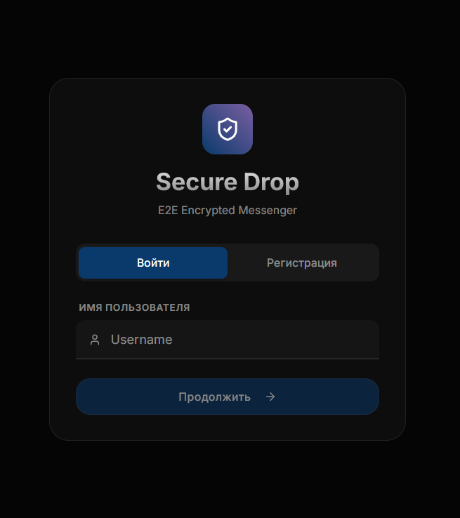
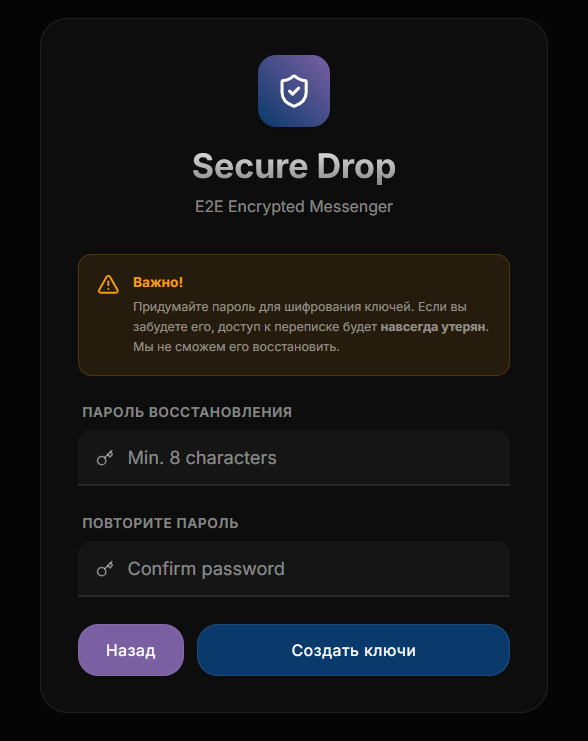
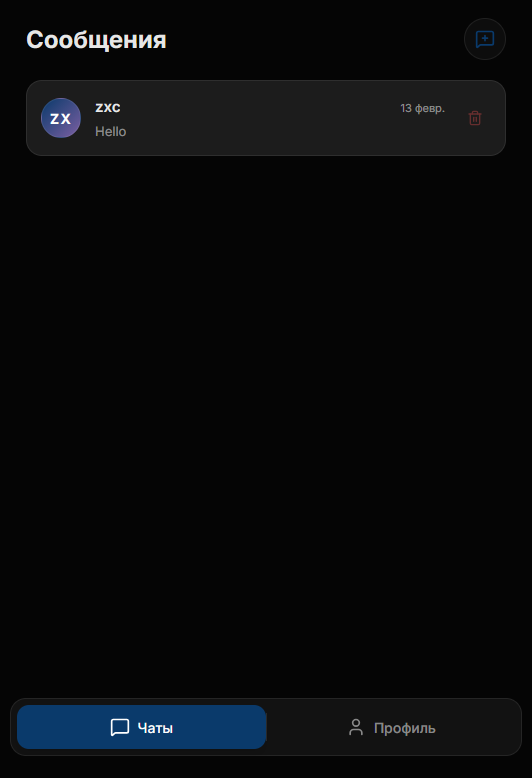

# Secure Drop Messenger

Secure Drop — это безопасное приложение для обмена сообщениями с **end-to-end шифрованием (E2EE)**, разработанное для обеспечения максимальной приватности. Интерфейс выполнен в стиле **Liquid Glass** и поддерживает работу как PWA.

## Галерея

<p align="center">
  
  
  
</p>

*Слева направо: Вход по TOTP, Расшифровка ключей паролем, Список чатов.*

## Ключевые особенности

*   **Сквозное шифрование (E2EE)**:
    *   Ключи (ECDH P-256) генерируются на устройстве.
    *   Сообщения шифруются (AES-GCM 256) *до* отправки на сервер.
    *   Сервер не имеет технической возможности прочитать переписку.
*   **Анонимность**: Вход только по Username + TOTP. Никаких телефонов или Email.
*   **Zero-Knowledge Recovery**: Приватный ключ шифруется вашим паролем и хранится на сервере в виде "каши". Если вы забудете пароль, переписка будет утеряна навсегда.
*   **Liquid Glass UI**: Современный, плавный интерфейс с размытием и анимациями.
*   **PWA**: Устанавливается как приложение на iOS/Android.

## Архитектура Безопасности

Подробный разбор механизмов защиты описан в [SECURITY.md](SECURITY.md).

*   **Транспорт**: HTTPS/WSS (TLS 1.2+).
*   **Аутентификация**: TOTP (Time-based One-Time Password) + JWT.
*   **Защита ключей**: Приватные ключи шифруются алгоритмом PBKDF2 + AES-GCM.

## Дизайн Система

Мы используем дизайн-систему **Liquid Glass**. Подробнее: [design.md](design.md).

*   **Философия**: Глубина, стекло, неоновые акценты на темном фоне.
*   **Стек**: Tailwind CSS + Custom CSS Variables.

## Технологический стек

*   **Frontend**: React, TypeScript, Vite, Tailwind CSS
*   **Backend**: Python, FastAPI, SQLAlchemy
*   **База данных**: PostgreSQL
*   **Кэш/Realtime**: Redis
*   **Инфраструктура**: Docker, Caddy (Auto HTTPS)

## Быстрый старт (Production)

Полная инструкция: [SERVER_DEPLOY.md](SERVER_DEPLOY.md).

1.  **Установка**:
    ```bash
    git clone https://github.com/yourusername/secure_drop.git
    cd secure_drop
    cp .env.example .env
    # Настройте .env (SITE_ADDRESS, SECRET_KEY...)
    ```

2.  **Запуск**:
    ```bash
    docker compose up -d --build
    ```

3.  **Использование**:
    Откройте ваш домен. HTTPS настроится автоматически.

## Структура проекта

*   `/backend`: API и логика (FastAPI)
*   `/front`: Интерфейс (React)
*   `/pics`: Скриншоты
*   `SECURITY.md`: Документация безопасности
*   `SERVER_DEPLOY.md`: Инструкция по деплою

## Лицензия

MIT
